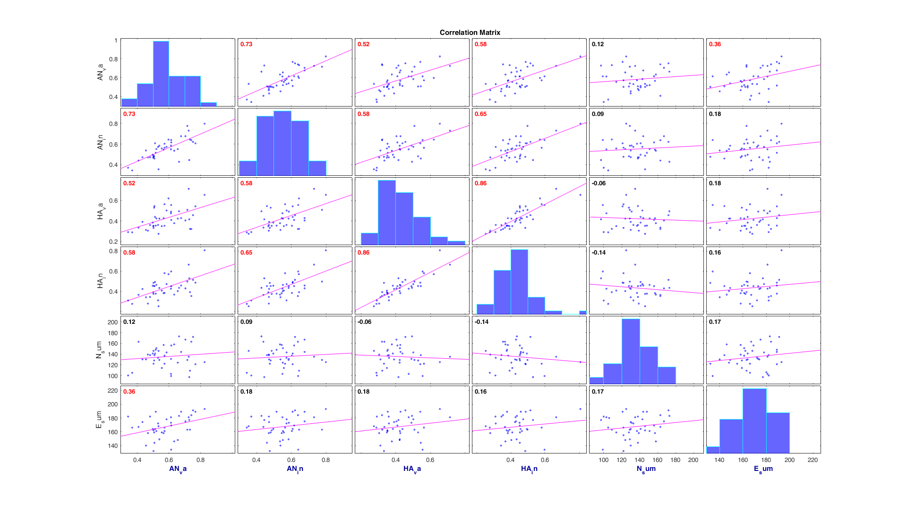
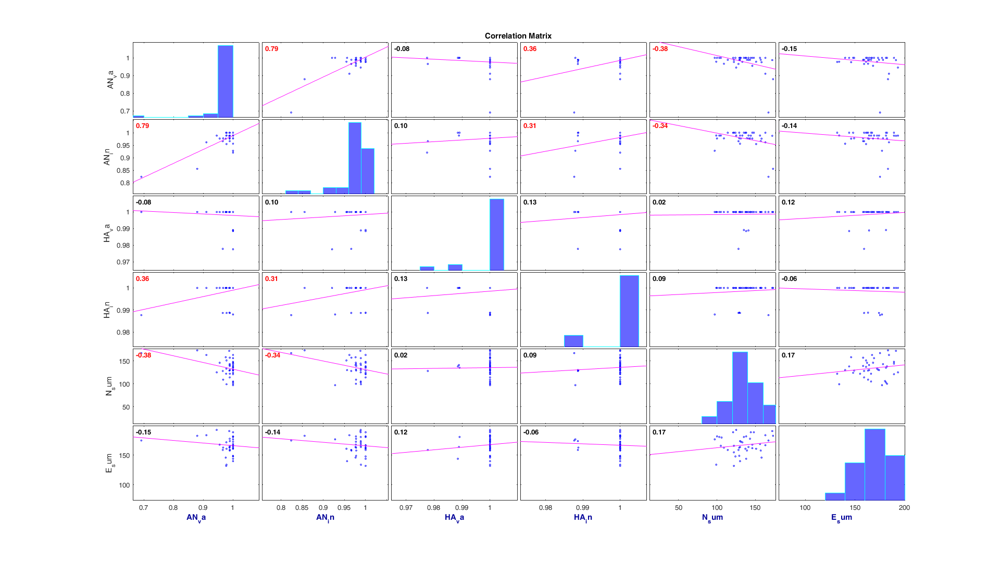

# Correlation between experimental/behavioural measures and NEO-PI-R (N & E)

Only reporting variable groups where at least one correlation is significant (two-tailed tests on Pearson correlation coefficients)

## Reaction Times

NEO-E correlates at *r = .36* (*p = .023*) with the reaction time in the Anger (valid) Condition of the **Response Switching** experiment:

## Proportion of Hits

NEO-N correlates at *r = -.38* and *r = -.34* (*p < .05*) with the proportion of Hits in the Anger (valid) and Anger (invalid) Conditions of the **Response Switching** experiment.

Those correlations are inverted when looking at the proportion of false Positives. The proportion of Omissions shows no significant correlations with NEO scores.
