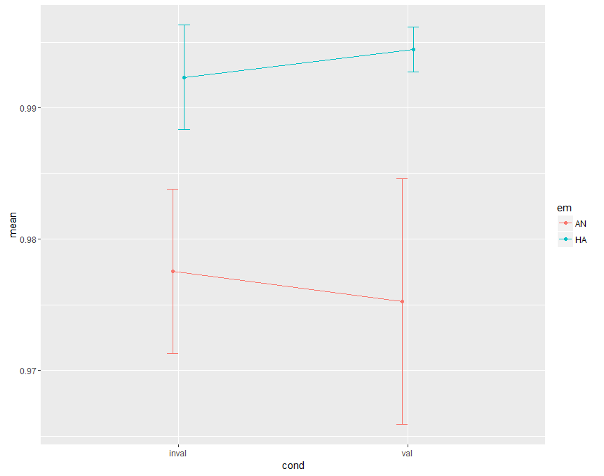
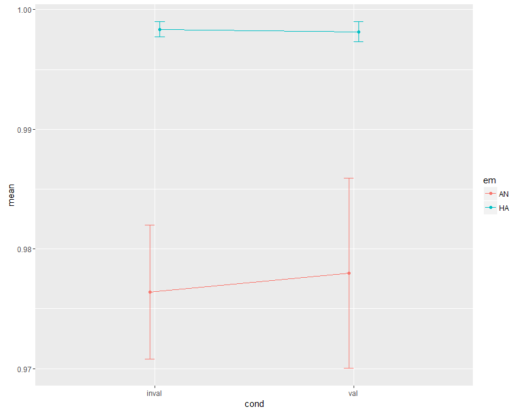
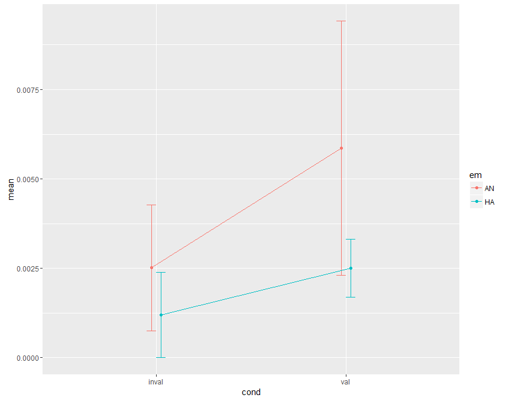
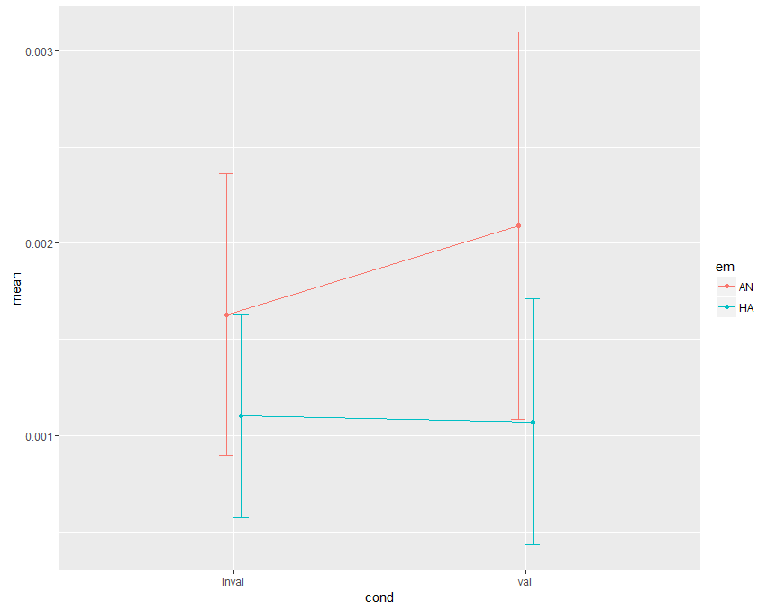
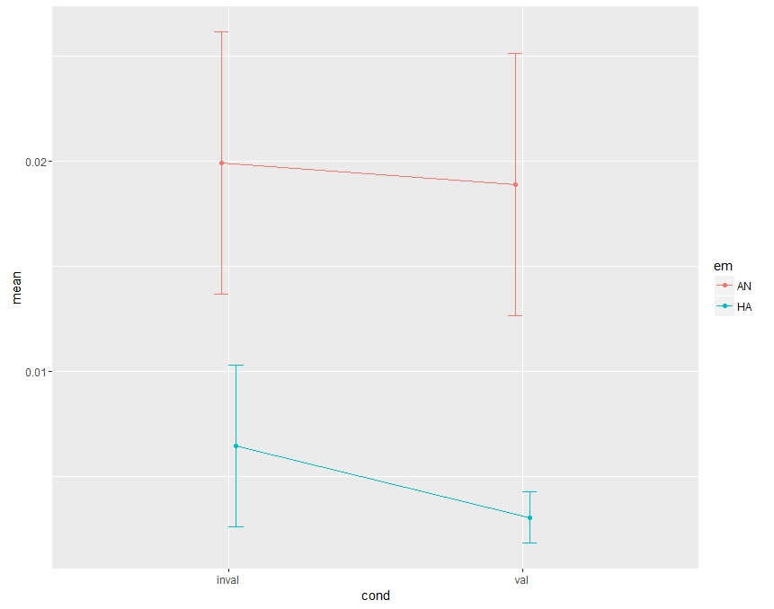
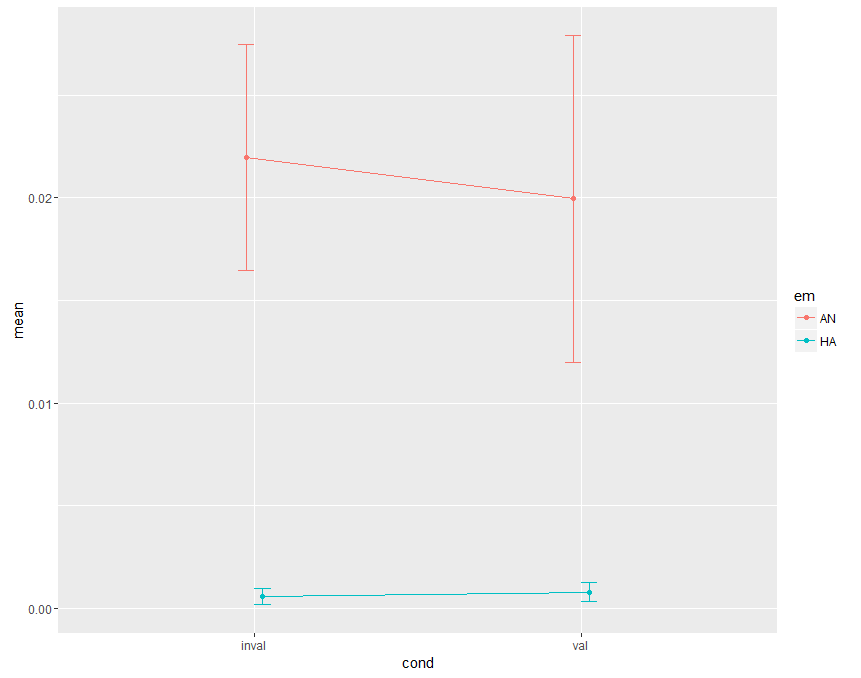

# Testing effects on proportion of Hit, Omission and False Positive Trials
rmANOVA with propX = intercept + emotion + validity + emotion*validity

## Proportion of Hits
### Response Priming
|Effect      | DFn| DFd|     SSn|   SSd|         F|     p|p<.05 |   ges|
|:-----------|---:|---:|-------:|-----:|---------:|-----:|:-----|-----:|
|(Intercept) |   1|  41| 162.962| 0.097| 68882.152| 0.000|*     | 0.998|
|em          |   1|  41|   0.012| 0.080|     6.229| 0.017|*     | 0.046|
|cond        |   1|  41|   0.000| 0.038|     0.000| 0.983|      | 0.000|
|em:cond     |   1|  41|   0.000| 0.036|     0.230| 0.634|      | 0.001|

### Response Switching
|Effect      | DFn| DFd|     SSn|   SSd|         F|     p|p<.05 |   ges|
|:-----------|---:|---:|-------:|-----:|---------:|-----:|:-----|-----:|
|(Intercept) |   1|  41| 163.897| 0.074| 90649.419| 0.000|*     | 0.999|
|em          |   1|  41|   0.019| 0.069|    11.036| 0.002|*     | 0.101|
|cond        |   1|  41|   0.000| 0.009|     0.086| 0.771|      | 0.000|
|em:cond     |   1|  41|   0.000| 0.012|     0.109| 0.743|      | 0.000|

## Proportion of Omissions
### Response Priming
|Effect      | DFn| DFd|   SSn|   SSd|     F|     p|p<.05 |   ges|
|:-----------|---:|---:|-----:|-----:|-----:|-----:|:-----|-----:|
|(Intercept) |   1|  41| 0.002| 0.010| 6.576| 0.014|*     | 0.048|
|em          |   1|  41| 0.000| 0.008| 1.256| 0.269|      | 0.007|
|cond        |   1|  41| 0.000| 0.007| 1.331| 0.255|      | 0.007|
|em:cond     |   1|  41| 0.000| 0.007| 0.275| 0.603|      | 0.001|

### Response Switching
|Effect      | DFn| DFd| SSn|   SSd|      F|     p|p<.05 |   ges|
|:-----------|---:|---:|---:|-----:|------:|-----:|:-----|-----:|
|(Intercept) |   1|  41|   0| 0.001| 10.231| 0.003|*     | 0.086|
|em          |   1|  41|   0| 0.001|  0.991| 0.325|      | 0.006|
|cond        |   1|  41|   0| 0.000|  0.184| 0.671|      | 0.000|
|em:cond     |   1|  41|   0| 0.001|  0.112| 0.739|      | 0.001|

## Proportion of False Positives
### Response Priming
|Effect      | DFn| DFd|   SSn|   SSd|      F|     p|p<.05 |   ges|
|:-----------|---:|---:|-----:|-----:|------:|-----:|:-----|-----:|
|(Intercept) |   1|  41| 0.025| 0.064| 15.738| 0.000|*     | 0.132|
|em          |   1|  41| 0.009| 0.052|  7.036| 0.011|*     | 0.053|
|cond        |   1|  41| 0.000| 0.022|  0.387| 0.537|      | 0.001|
|em:cond     |   1|  41| 0.000| 0.023|  0.104| 0.748|      | 0.000|

### Response Switching
|Effect      | DFn| DFd|   SSn|   SSd|      F|     p|p<.05 |   ges|
|:-----------|---:|---:|-----:|-----:|------:|-----:|:-----|-----:|
|(Intercept) |   1|  41| 0.020| 0.071| 11.332| 0.002|*     | 0.108|
|em          |   1|  41| 0.017| 0.072|  9.895| 0.003|*     | 0.097|
|cond        |   1|  41| 0.000| 0.009|  0.148| 0.702|      | 0.000|
|em:cond     |   1|  41| 0.000| 0.009|  0.232| 0.632|      | 0.000|

