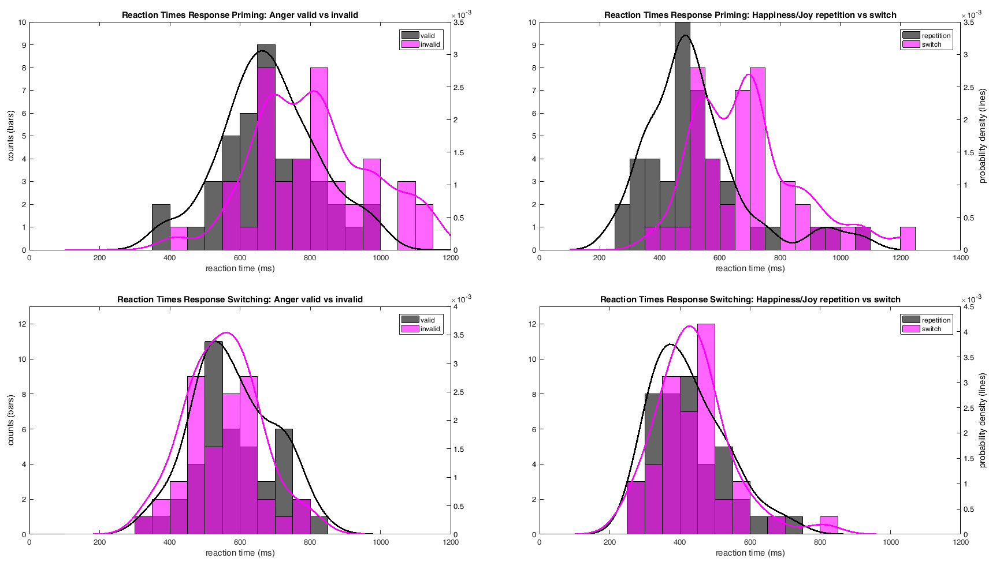
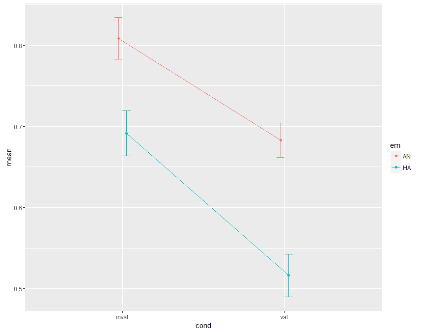
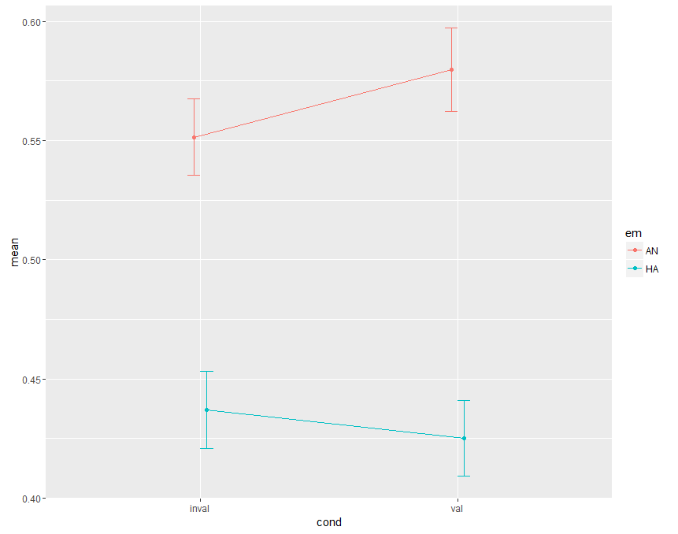

# DV Reaction Time

## Marginal Distributions
(with smoothed proability density kernel)

## Testing effects on reaction time
rmANOVA with rt = intercept + emotion + validity + emotion*validity

### Response Priming
|Effect      | DFn| DFd|     SSn|   SSd|       F|      p|p<.05 |    $\eta^2$|
|:-----------|---:|---:|-------:|-----:|-------:|------:|:-----|------:|
|(Intercept) |   1|  41| 76.4856| 3.130| 1002.04| 0.0000|*     | 0.9451|
|em          |   1|  41|  0.8449| 0.966|   35.87| 0.0000|*     | 0.1598|
|cond        |   1|  41|  0.9495| 0.233|  167.10| 0.0000|*     | 0.1761|
|em:cond     |   1|  41|  0.0256| 0.114|    9.21| 0.0042|*     | 0.0057|

### Response Switching
|Effect      | DFn| DFd|        SSn|       SSd|           F|         p|p<.05 |       $\eta^2$|
|:-----------|---:|---:|----------:|---------:|-----------:|---------:|:-----|---------:|
|(Intercept) |   1|  41| 41.7095638| 1.3723817| 1246.076175| 0.0000|*     | 0.9573|
|em          |   1|  41|  0.7591773| 0.2926622|  106.355605| 0.0000|*     | 0.2900|
|cond        |   1|  41|  0.0027717| 0.0993028|    1.144368| 0.2910|      | 0.0015|
|em:cond     |   1|  41|  0.0169572| 0.0943336|    7.370055| 0.0097|*     | 0.0090|

